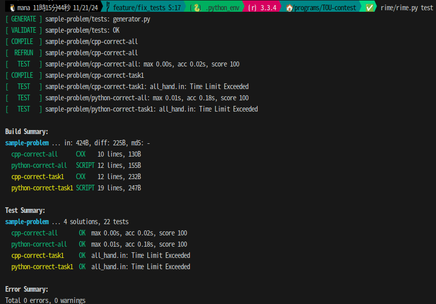

# TOU-contest-001

## rimeの使い方や実装方針
* submoduleとして既にプロジェクトに組み込まれているので各自のインストールは不要
* 既にサンプルとして問題が用意されているので、基本的にはそれをコピペして仕様する
* `rime/rime.py test` を実行することでテストを実施


### ディレクトリ構成
```
a+b                             // 問題名
├── PROBLEM                  
├── cpp-correct-all          
│   ├── SOLUTION
│   └── main.cc             // 100点解法のソースコード
├── cpp-correct-task1
│   ├── SOLUTION
│   └── main.cc             // 部分点1解法のソースコード
├── python-correct-all
│   ├── SOLUTION
│   └── main.py             
├── python-correct-task1
│   ├── SOLUTION
│   └── main.py
├── statement.md           　 // 問題文(Markdown) 
└── tests                     // 本番で使用するテストケース
    ├── TESTSET
    ├── all_hand.diff
    ├── all_hand.in
    ├── task1_hand.diff
    ├── task1_hand.in
    ├── generator.py          // 入力生成器
    └── validator.py          // 入力検証器
```

### ブランチ
* 問題名でブランチを作成する
* 完成をもってして`main`ブランチに問題のブランチをマージする
* 完成していなくても現時点でできている範囲だけ`integrateAll`にマージしてよい
  
### 各設定ファイルのサンプル

#### PROBLEM
```
# -*- coding: utf-8; mode: python -*-

## Problem definition.
## Required fields are:
##   title: The problem title shown in test summary.
##   id: The problem ID (typically starts from A) used to order problems.
##   time_limit: The time limit of this problem in seconds.
pid = 'X'                                      
problem_name = "A+B Problem"                    // 問題名
problem(title = pid + ": " + problem_name,
        # wiki_name = 'A+B',
        # assignees = 'assignee',
        # need_custom_judge = False,
        id = pid,
        time_limit = 1.0,                       // ※必須 実行時間制約
        )

```

#### TESTSET

```
# -*- coding: utf-8; mode: python -*-

## Input generators.
#c_generator(src='generator.c')
#cxx_generator(src='generator.cc')
#java_generator(src='Generator.java', encoding='UTF-8', mainclass='Generator')
script_generator(src='generator.py')                // 入力出力器

## Input validators.
#c_validator(src='validator.c')
#cxx_validator(src='validator.cc')
#java_validator(src='Validator.java', encoding='UTF-8', mainclass='Validator')
script_validator(src='validator.py')                // 入力検証器

## Output judges.
#c_judge(src='judge.c')
#cxx_judge(src='judge.cc')
#java_judge(src='Judge.java', encoding='UTF-8', mainclass='Judge')
#script_judge(src='judge.py')
subtask_testset(name='task1', score=10, input_patterns=['task1_*.in'])      // 部分点1のテストケース
subtask_testset(name='all', score=90, input_patterns=['*.in'])              // 満点解のテストケース
```
* input_patternsは正規表現で指定できる
```
// 部分点が2つある場合の例
subtask_testset(name='task1', score=10, input_patterns=['task1*.in'])
subtask_testset(name='task2', score=10, input_patterns=['task[12]*.in'])
subtask_testset(name='all', score=80, input_patterns=['*.in'])
```
  

#### SOLUTION

```
# -*- coding: utf-8; mode: python -*-

## Solution definition.
## Choose and modify one of definitions below.
## Adding a parameter challenge_cases marks this solution as a wrong solution.
#c_solution(src='main.c')
cxx_solution(src='main.cc')                                  // 同ディレクトリの回答ファイルを指定する
#java_solution(src='Main.java', encoding='UTF-8', mainclass='Main')
#script_solution(src='main.py')
expected_score(100)                                          // 想定スコア
```

### 参考

* rime運用やGithubActionsの書き方を参考にした  
https://github.com/Kyo-s-s/cyan-or-less-procon-2024-spring

* rime公式wiki  
https://rime.readthedocs.io/ja/latest/

* rime非公式ドキュメント  
https://rime-doc.readthedocs.io/ja/latest/intro/overview.html

* rimeのわかりやすい解説記事  
https://qiita.com/hiroshi-cl/items/fbd0d0963d8207d33bc6
